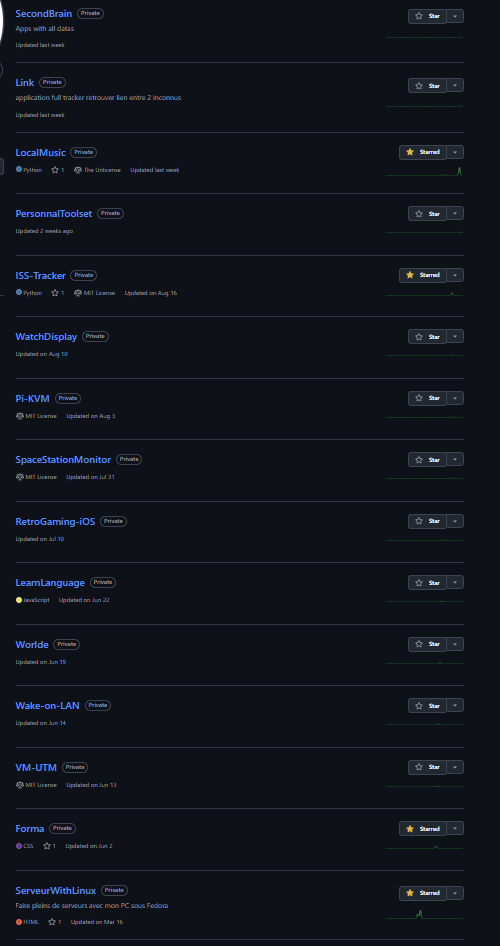
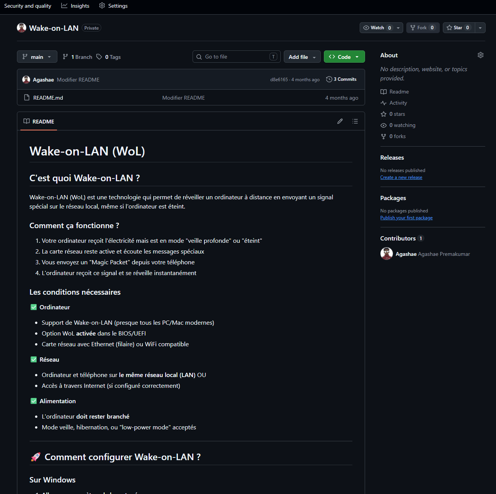

# AgaNews

Mes mini-projets, astuces et découvertes qui méritent une page, mais pas un repo entier

🌐 [agashae.github.io/AgaNews](https://agashae.github.io/AgaNews/)

## Mon erreur

Avant, je créais un repo pour tout, même pour une simple astuce.  
Résultat : un GitHub rempli de dépôts quasi vides, avec un README de trois lignes et aucun code.  Impossible de s'y retrouver, et mes vrais projets étaient noyés au milieu.

## Article ou repo ?

| Article AgaNews | Repo GitHub |
|---|---|
| Projet court, une astuce | Projet qui évolue dans le temps |
| Surtout du texte et des images | Beaucoup de code à versionner |

**Si ça se lit, c'est un article. Si ça se maintient, c'est un repo.**

## Exemple

Mon ancien repo `Wake-on-LAN` n'avait aucune ligne de code, juste un README d'explications. Il est devenu un article.

