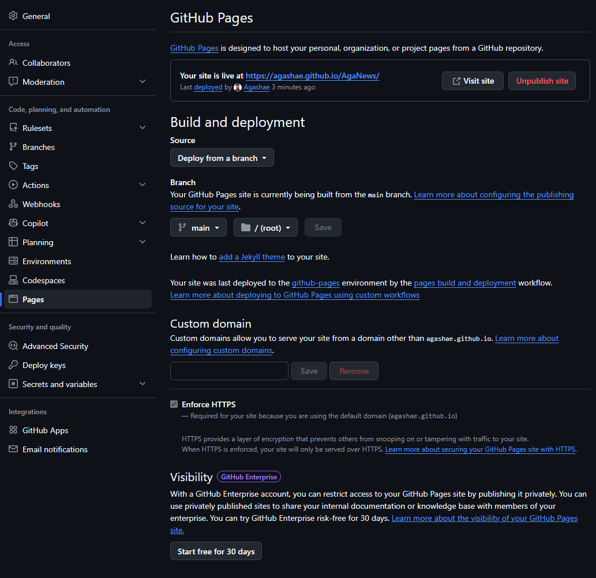

# Comment j'ai mis AgaNews en ligne

J'ai publié mon site gratuitement avec GitHub Pages

## Les étapes

- Créer le repo sur GitHub
- Faire un commit et un push depuis VS Code d'un index.html au minimum (c'est + simple que donner un autre url)
- Activer Pages dans Settings → Pages
- Attendre quelques secondes et il sera là
- Si ça marche pas, je fais Branch -> Main en Root -> Root en Main

